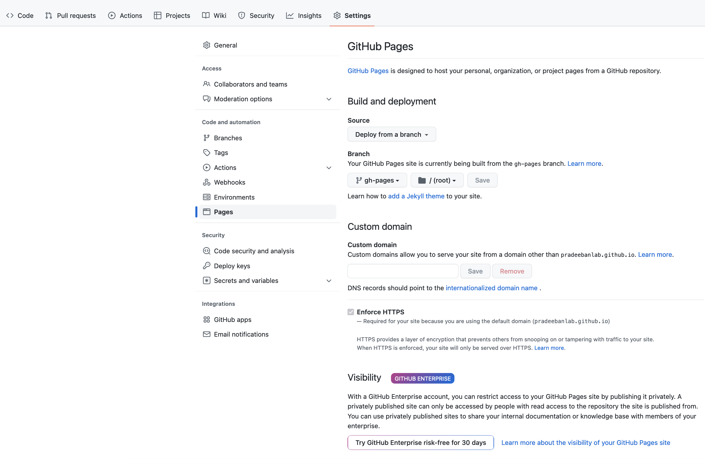

# The _concore_ Editor

This is a fork of DHGWorkflow, visual Directed Hypergraph Workflow Composer, finetuned to operate as a frontend for _concore_.

Key Features of the _concore_ Editor:
* Export-import graph as a graphml file.
* Export graph as JPEG/PNG
* Undo-Redo Actions
* Drag Drop Nodes
* Create Edges easily
* Bend Edges

and many more!


## Installing it locally
This is a frontend tool built with React Js.
Steps to start it locally
1. Clone the repository
2. At the root of the repository, run the following commands:
    1. `npm i`
    2. `npm start`
3. It should start a development server and tool will be accessible at
    `http://localhost:3000/DHGWorkflow`
4. Note - In case, you're using Windows and see the linebreak-error please modify line 53 in `.eslintrc.json` file to `"linebreak-style": ["error", "windows"]`. Make sure you do not commit this change to prevent default environment.

## Creating a generic Graph Builder.

The generic graph can be built out of two ways.

### 1. Check out the Generic branch
This branch will be synced with the changes from the main periodically. Easy to switch but do not guarantee up to date changes.
1. `git checkout generic`
2. `npm i`
3. `npm start`

If this throws a long error in the browser and console about line endings (LF/CRLF), please follow the below steps.

In  ~/.gitconfig, set autocrlf to false as below.
````
[core]
         autocrlf = false
````

Then run the below from the concore editor source code in terminal.

````
git rm --cached -r .
git reset --hard
git pull --rebase
````

Now re-run with npm as above.


This branch may contain `src/graph-builder/tailored-graph-builder.js`. It can be safely removed.

### 2. Make changes to the master branch
You can convert the existing graph builder to generic by following these simple steps

1. At `src/graph-builder/index.js` replace   
`import GraphBuilder from './tailored-graph-builder';` with  
`import GraphBuilder from './graph-core';`
2. Delete `src/graph-builder/tailored-graph-builder.js` (Optional)

This method is more error-prone.

### How it works?
This project requires building a graph with some special kind of hyperedges.  
`src/graph-builder/graph-core/*` contains all the classes required for building a generic GraphBuilder (with simple edges) and `src/graph-builder/tailored-graph-builder.js` extends the core graph and add logics to create hyperedges.

If we create our instance of the graph with `tailored-graph-builder`, we will get graph builder which will have hyperedges specialized for this project requirement whereas creating the instance from `graph-core` will result in a generic graph builder with simple edges.

# Deploying concore-editor in GitHub

If you have forked this repository, make sure to configure the GitHub actions. This is done *only once* for the entire GitHub deployment. Go to your fork's settings/pages (for example, https://github.com/pradeebanlab/concore-editor/settings/pages), and enable the GitHub Pages as shown below.



Once this is configured, every time you want to update the hosted concore-editor, you need to run the "Build and Deploy" action as elaborated below.

We have two workflows.

* Build - triggers automatically on every push and pull just to ensure the new PRs are consistent.

* Build and Deploy - This has to be triggered manually and updates the online deployed version. This ensures that any PR containing breaking change doesn't affect the user directly
 

Please go to the url https://github.com/ControlCore-Project/concore-editor/actions/workflows/buildAndDeploy.yml and trigger this particular workflow. This will in turn automatically trigger the Pages Build and Deploy action. Once that action also completes successfully, the new page will be alive. Depending on the nature of the changes, you may need to clear the cache/cookies to make the changes visible to your browser. You can choose to delete just the cookies and data of controlcore-project.github.io as stored in your browser. Please check the browser documentation for more information on deleting the cookies.

 
